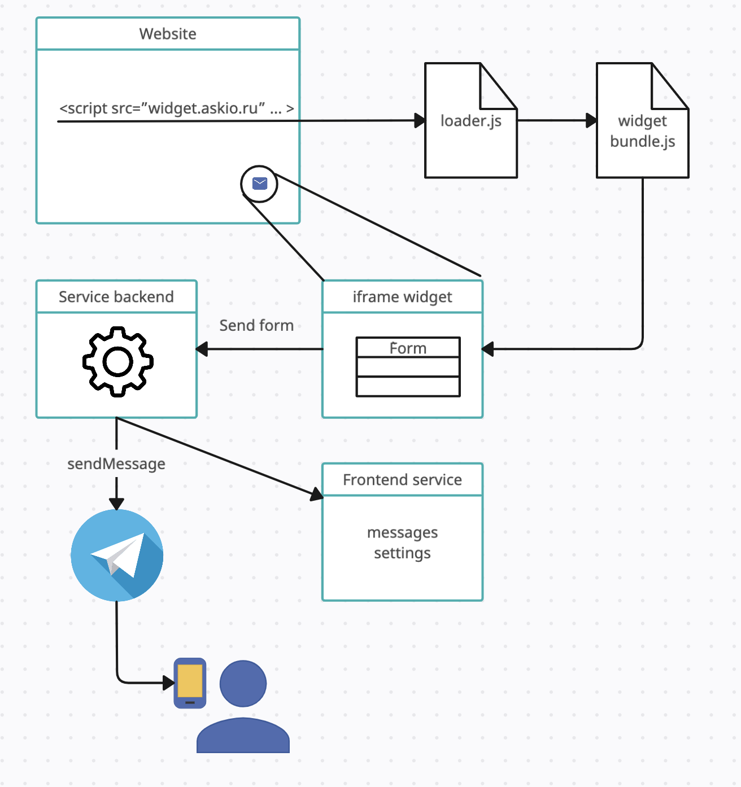

# Telegram forms

Backend part of the service for sending forms from the website to the telegram messenger

- NodeJS
- Typescript
- MongoDB
- JWT Authentication




## Pre-requisites
- Install [Node.js](https://nodejs.org/en/) version 16
- Install MongoDB

## Getting started

Install dependencies
```
npm install
```
Run the project
```
npm dev
```
Navigate to `http://localhost:3000`
